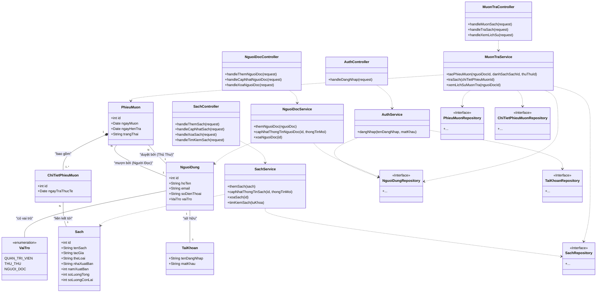

```mermaid
classDiagram
    %% 1. Lớp Thực thể (Entities) %%
    class NguoiDung {
        +int id
        +String hoTen
        +String email
        +String soDienThoai
        +VaiTro vaiTro
    }
    
    class TaiKhoan {
        +String tenDangNhap
        +String matKhau
    }

    class Sach {
        +int id
        +String tenSach
        +String tacGia
        +String theLoai
        +String nhaXuatBan
        +int namXuatBan
        +int soLuongTong
        +int soLuongConLai
    }

    class PhieuMuon {
        +int id
        +Date ngayMuon
        +Date ngayHenTra
        +String trangThai
    }

    class ChiTietPhieuMuon {
        +int id
        +Date ngayTraThucTe
    }

    class VaiTro {
        <<enumeration>>
        QUAN_TRI_VIEN
        THU_THU
        NGUOI_DOC
    }

    %% 2. Lớp Dịch vụ (Services) %%
    class AuthService {
        +dangNhap(tenDangNhap, matKhau)
    }

    class SachService {
        +themSach(sach)
        +capNhatThongTinSach(id, thongTinMoi)
        +xoaSach(id)
        +timKiemSach(tuKhoa)
    }

    class NguoiDocService {
        +themNguoiDoc(nguoiDoc)
        +capNhatThongTinNguoiDoc(id, thongTinMoi)
        +xoaNguoiDoc(id)
    }

    class MuonTraService {
        +taoPhieuMuon(nguoiDocId, danhSachSachId, thuThuId)
        +traSach(chiTietPhieuMuonId)
        +xemLichSuMuonTra(nguoiDocId)
    }

    %% 3. Lớp Điều khiển (Controllers) %%
    class AuthController {
        +handleDangNhap(request)
    }

    class SachController {
        +handleThemSach(request)
        +handleCapNhatSach(request)
        +handleXoaSach(request)
        +handleTimKiemSach(request)
    }

    class NguoiDocController {
        +handleThemNguoiDoc(request)
        +handleCapNhatNguoiDoc(request)
        +handleXoaNguoiDoc(request)
    }

    class MuonTraController {
        +handleMuonSach(request)
        +handleTraSach(request)
        +handleXemLichSu(request)
    }

    %% 4. Lớp Truy cập Dữ liệu (Repositories) %%
    class NguoiDungRepository {
        <<Interface>>
        +...
    }
    class TaiKhoanRepository {
        <<Interface>>
        +...
    }
    class SachRepository {
        <<Interface>>
        +...
    }
    class PhieuMuonRepository {
        <<Interface>>
        +...
    }
    class ChiTietPhieuMuonRepository {
        <<Interface>>
        +...
    }

    %% Quan hệ giữa các Thực thể %%
    NguoiDung "1" -- "1" TaiKhoan : "sở hữu"
    NguoiDung -- VaiTro : "có vai trò"
    PhieuMuon "N" -- "1" NguoiDung : "mượn bởi (Người Đọc)"
    PhieuMuon "N" -- "1" NguoiDung : "duyệt bởi (Thủ Thư)"
    PhieuMuon "1" *-- "1..*" ChiTietPhieuMuon : "bao gồm"
    ChiTietPhieuMuon "N" -- "1" Sach : "liên kết tới"

    %% Quan hệ Phụ thuộc (Dependencies) giữa các lớp %%
    
    %% Controllers -> Services
    AuthController ..> AuthService
    SachController ..> SachService
    NguoiDocController ..> NguoiDocService
    MuonTraController ..> MuonTraService

    %% Services -> Repositories
    AuthService ..> TaiKhoanRepository
    AuthService ..> NguoiDungRepository
    SachService ..> SachRepository
    NguoiDocService ..> NguoiDungRepository
    MuonTraService ..> PhieuMuonRepository
    MuonTraService ..> ChiTietPhieuMuonRepository
    MuonTraService ..> SachRepository
    MuonTraService ..> NguoiDungRepository
    
    %% Services sử dụng Entities (biểu diễn ngắn gọn)
    SachService ..> Sach
    NguoiDocService ..> NguoiDung
    MuonTraService ..> PhieuMuon
```
